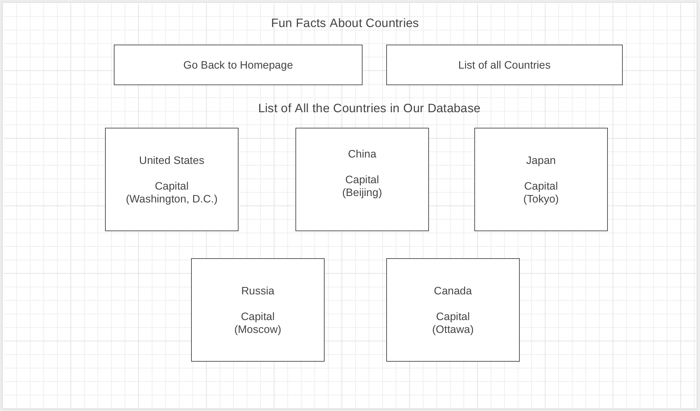
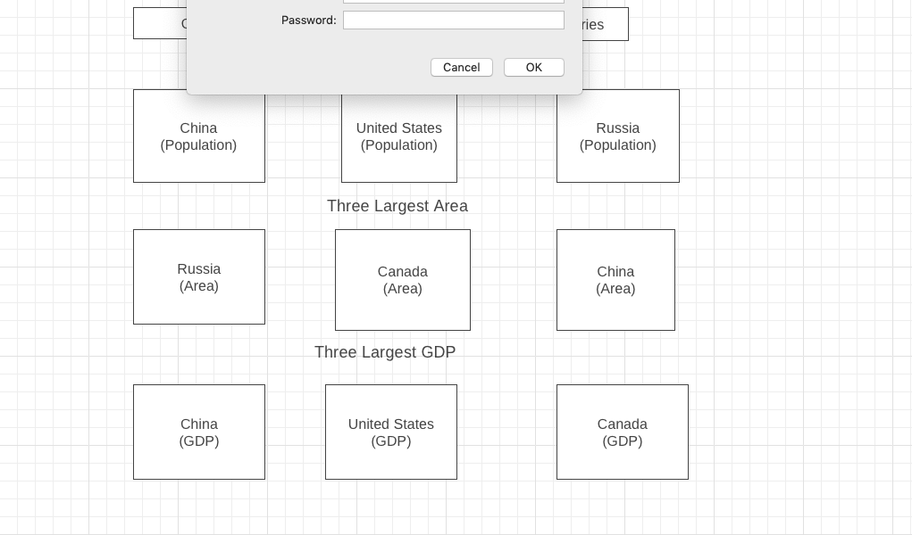
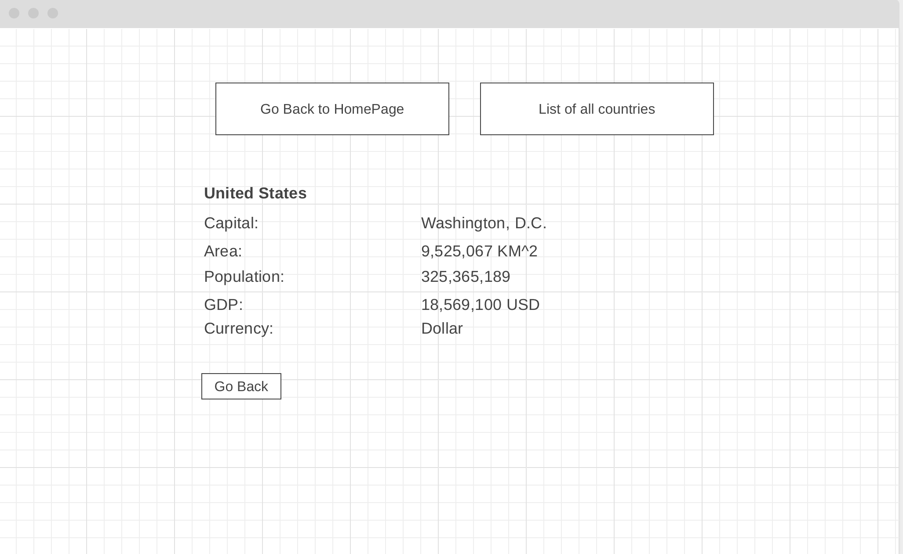

# Capstone Project

## Project Description

### The country information app that I am creating will have three components. The HomeComponent will show the top three countries under various categories. Like population, GDP, and area. You will be able to click the name of each country to read more about it. The additional information about the country is listed using another component, which I will be named the CountryDetailComponent. There will be one more component in the app, which will be used to display a list of all the countries that we have stored in our app.

## Wireframe / Functional components

### Country.ts
- Defines Country class 

 ### Country.service.ts
- This will contain the different functions that will manipulate the data inside country-data.ts file to get population, gdp, and area

 ### Country-data.ts
- Imports country.ts
- Holds array called Country

 ### App.component.html
- Linked home component and all countries component

 ### App-routing.module.ts
- Contains all routing paths for home component, all-country component, 

- CountryDetail component

 ### HomeComponent 
 
 - Contains three methods that returns country object, grabs countries with largest gap, area, highest population, and then returns the name of the country

 ### Allcountries component
- Imported Country and CountryService classes
- Created a countries property that accepts an array of Country objects as its value
- The CountryService class is added to the component using dependency injection
- ngOnIt calls the getCountries() method of CountryService class upon initialization
- The getCountries() method relies on getCountries() method from CountryService class, which returns an array of Country objects
- In html *ngfor lists all countries obtained by the getCountries() method and stored in the countries property of the AllCountriesComponent class
- This component displays capitals of each country using the capital property.

 ### Country detail component
- Shows details of country one at a time whenever user clicks on the name of any country listed inside either the HomeComponent or AllCountriesComponent
- Imported ActivatedRoute and Location
- ActivatedRoute 
- Location is used to allow this application to interact with the browser's url

