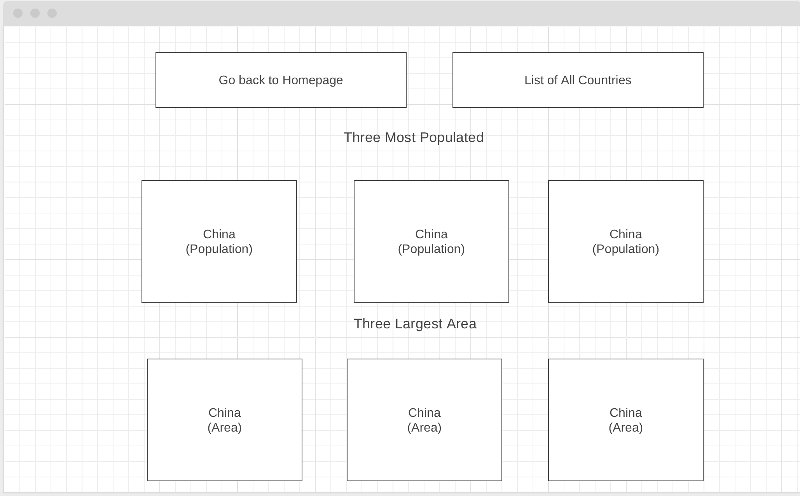

# Capstone Project

## Project Description

### The country information app that I am creating will have three components. The HomeComponent will show the top three countries under various categories. Like population, GDP, and area. You will be able to click the name of each country to read more about it. The additional information about the country is listed using another component, which I will be named the CountryDetailComponent. There will be one more component in the app, which will be used to display a list of all the countries that we have stored in our app.

## Wireframe / Functional components

### Country.ts
- Defined parameters to how defined object properties

 ### Country.service.ts
- This will contain the different functions that will manipulate the data inside country-data.ts file

 ### Country-data.ts
- Imports country.ts
- Holds array of object for each country

 ### App.component.html
- Linked home component and all countries component

 ### App-routing.module.ts
- Contains all routing paths for home component, all-country component, 

- CountryDetail component

 ### HomeComponent 
 
 - Contains three methods that returns country object, grabs countries with largest gap, area, highest population, and then returns the name of the country

 ### Allcountries component
- In html has ngfor directive to loop through the country array that we grabbed from 
- Has injectable country service
- Ngonit has this.getcountries which grabs the method we created in country service
- Get countries method 

   

 ### Country detail component
- Shows details of country one at a time

